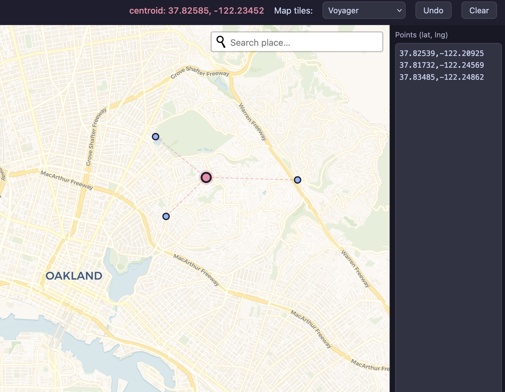

# point center

Click on a map to place points. The geographic centroid updates live as you add them.

**Test it out: https://arvi1000.github.io/point_center/**

*The Three Safeway Problem*

## Usage

Open `index.html` in any browser. No installation, no server, no internet connection required beyond loading the map tiles.

- **Click** anywhere on the map to drop a point
- The **centroid** (pink dot) appears automatically once you have 2+ points, with dashed lines connecting each point to it
- The centroid coordinates are shown in the toolbar
- **Undo** removes the last point; **Clear** removes all points
- You can copy/paste the points in the text box on the side
- You can choose the map tileset in the dropdown

## Notes on accuracy

The centroid is calculated as the arithmetic mean of all point coordinates. This is accurate for points within a city or region. For points spread across hemispheres or spanning the antimeridian (±180° longitude), the result will be incorrect — a spherical centroid algorithm would be needed for those cases.

## Development

See [CLAUDE.md](CLAUDE.md) for technical notes.
